# Rendezvous 3D Panel

This Grafana panel plugin visualizes rendezvous telemetry for spacecraft in 3D. Operators can review position, attitude, and mission events in the same scene to build a shared situational awareness.

## Sample visualizations

### Relative layout of spacecraft and target asteroid
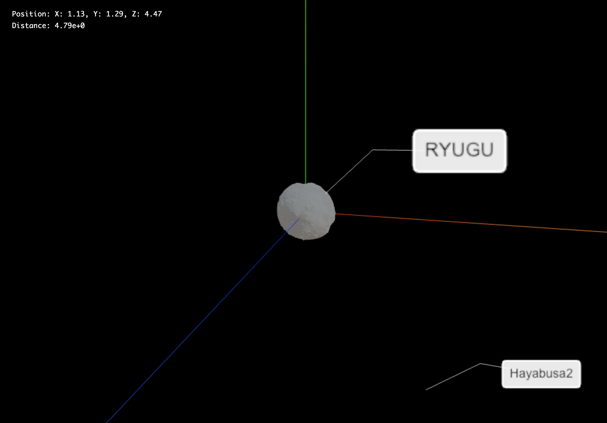
Register multiple objects (e.g., chaser spacecraft, target body, navigation markers) and review their relative positions and trajectories in one view via attitude-aware 3D models, spherical markers, and time-series polylines.

### Operations log view with annotations
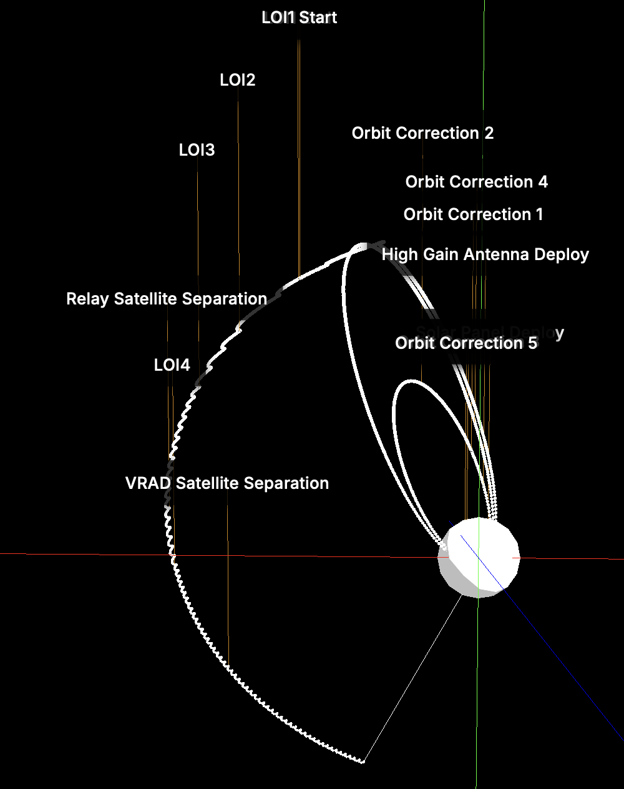
Annotation objects synchronize timestamps and notes with your data source so that key events appear in context. Switch the callout direction to fine-tune readability.

### Overview of the full rendezvous
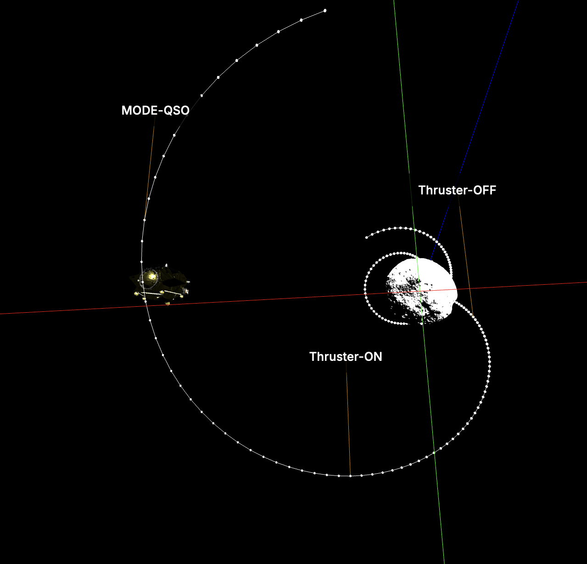
Switch camera targets to orbit around multiple assets. Scale adjustments let you inspect close-proximity docking maneuvers and long-range navigation within the same scene.

## Panel configuration guide

### 1. Lighting and background
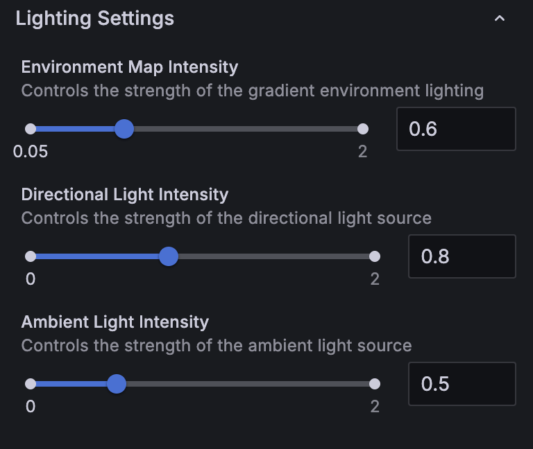
- Use `Background Color` to mimic deep space or adapt the palette to your operations environment.
- Tune `Ambient Light Intensity` (0 = fully off) to achieve the desired look for metallic spacecraft and markers.
- Enable `Point Light` to place a single point light source in the scene, driven by telemetry fields or constants just like object positions. Its light is blocked by the front faces of spheres and 3D models but passes through their back faces, so it can be used to simulate sunlight or another localized source casting shadows across the scene.
  - `Point Light Decay` controls how intensity falls off with distance: `None` (constant regardless of distance), `Linear` (1/d), or `Inverse Square` (1/d², physically accurate). Because scenes can span from tens of units to well beyond 10^8, pick `None` for a quick, distance-independent light and switch to `Linear`/`Inverse Square` with a correspondingly larger `Point Light Intensity` when physically accurate falloff is needed.

### 2. View-angle based auto scaling
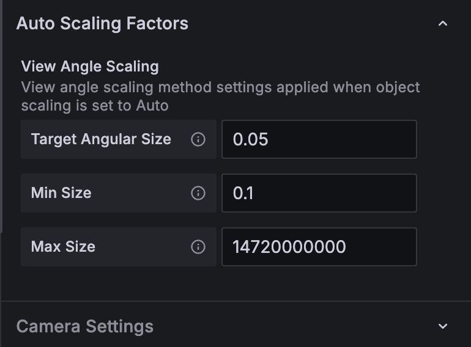
- Configure `Target Angular Size` and `Min/Max Size` to automatically scale spheres or 3D models relative to camera distance.
- Only objects with Auto Radius or Auto Scale enabled participate, balancing long-range visibility with close-range legibility.

The algorithm is implemented in `ViewAngleScaling.calculateViewBasedScale` (`src/components/utils/ViewAngleScaling.ts`). Each render cycle invokes `ThreeSceneObjectManager.updateViewAngleScaling`, which runs the workflow below.

1. Compute the Euclidean distance `d` between the camera and the object.
2. Use `targetAngularSize` (radians) to derive a physical size with constant apparent angle via `S = 2 * d * tan(targetAngularSize / 2)`.
3. Acquire the object's maximum bounding-length `L` (diameter for spheres, measured at model import for 3D models) and compute `scaleRaw = S / L`.
4. Clamp `scaleRaw` with `minSize` and `maxSize`, apply the aspect ratio adjustment `applyShapeAdjustment`, and multiply by `userData.originalScale` (including model-unit conversion) to produce the final scale. Legacy dashboards may also include their saved per-object scale factor.

Because this calculation runs immediately after camera movement, objects retain a consistent angular size through zoom operations. Disabling Auto Radius uses the configured sphere radius; disabling Auto Scale uses the 3D model's native size with its model-unit conversion.

### 3. Camera control and focus
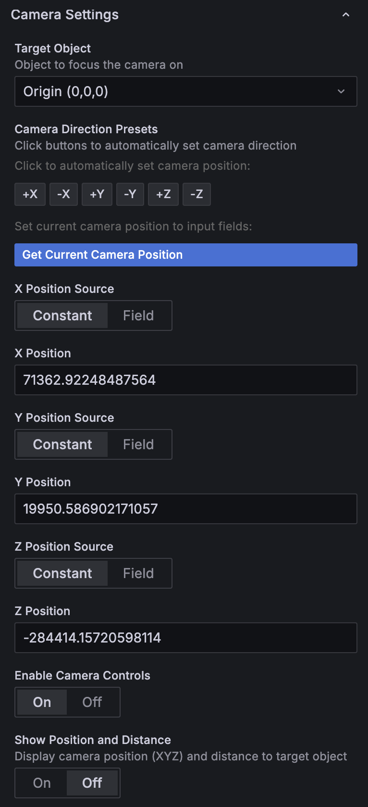
- Drive camera position with telemetry fields or constants. Field-backed coordinates use the field's latest value and refresh whenever Grafana supplies new panel data; constant-only positions are not reapplied by data refreshes.
- Enable `Enable Controls` to allow free-flight camera control via mouse input in Grafana.
- Specify a `Target Object` to keep the camera locked onto a chosen asset.
- Click `Get Current Camera Position` in the editor to snapshot the live (mouse-adjusted) camera position back into the `Pos X/Y/Z` constants.
- Two buttons are overlaid on the panel itself so operators can do the same without opening the editor:
  - **Save Camera Position** stores the camera's current live position into the panel options (equivalent to `Get Current Camera Position`).
  - **Reset Camera** instantly returns the camera to the saved/default position — no page reload required.
  - Each button can be hidden independently via the `Show "Save Camera Position" Button` / `Show "Reset Camera" Button` checkboxes next to the camera position controls (both default to on).

### 4. Object management
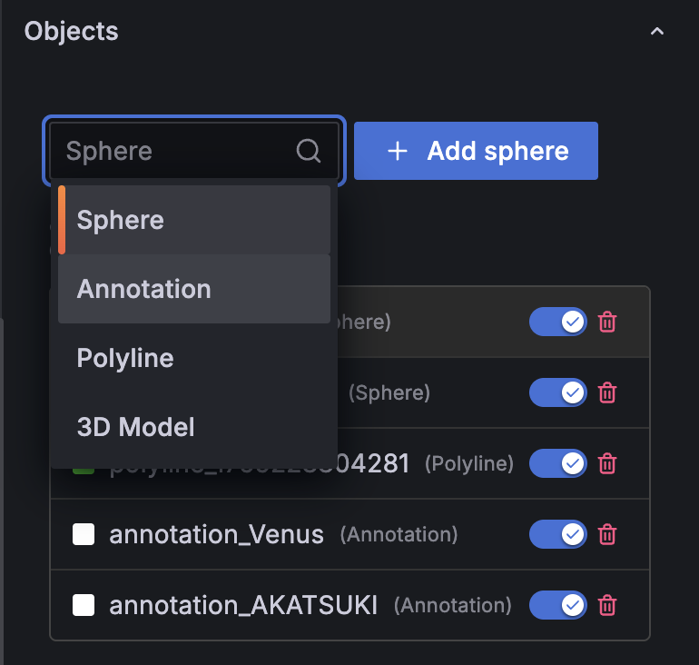
- Add any number of objects, adjusting draw order and visibility on demand.
- Choose a shape type (Sphere / 3D Model / Polyline / Annotation) under `Add Object`.

### 5. Object list and ordering
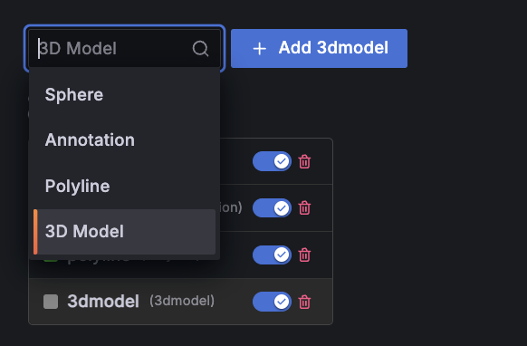
- Drag the right-side handle to reorder objects and control their render priority.
- Toggle `Visible` to hide or show an object temporarily.

### 6. Sphere objects
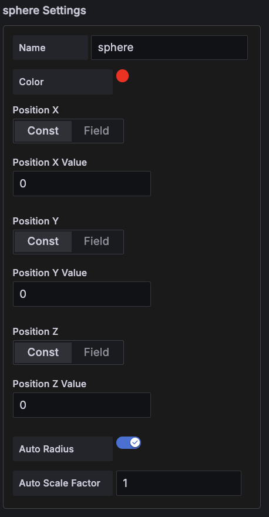
- Assign telemetry to `Pos X/Y/Z` fields to visualize targets as spheres.
- Choose between an explicit `Radius` and view-angle sizing with `Auto Radius`.
- Set `Brightness` to a fixed value or bind it to a field to darken the sphere (see [Brightness](#brightness) below).

### 7. 3D model objects
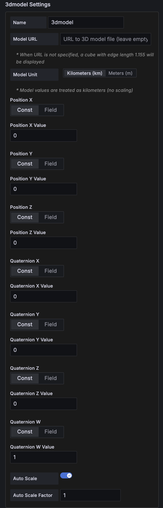
- Provide a GLTF or similar URL to load spacecraft geometry; a reference cube renders by default when no model is supplied.
- Enable `Auto Scale` to keep the model visible using view-angle scaling; disable it to use the model's native size.
- Bind telemetry to position and quaternion (`Quat X/Y/Z/W`) fields to show attitude.
- Use the per-model `Interpolation` settings to keep field-driven attitude motion smooth between data refreshes.
- Choose `Unit` (`km` or `m`) to normalize the scale.
- Set `Brightness` to a fixed value or bind it to a field to darken the model (see [Brightness](#brightness) below).

#### Brightness

Sphere and 3D Model objects have a `Brightness` control (Polyline and Annotation objects don't, since they're markers rather than solid bodies). Like the position and quaternion fields, it can be set to a fixed `Const` value or bound to a `Field`:

- `Const` (default `1`): a fixed value, `0` (black) to `1` (unchanged).
- `Field`: the latest value of a numeric field, re-evaluated on every data refresh. Values above `1` saturate to `1`; values below `0` saturate to `0`.

Brightness darkens the object's own color toward black by scaling it — it does not change opacity or transparency. The object stays fully solid under the same lighting (still correctly occludes other objects, with none of the draw-order issues transparency can introduce), it simply reflects less light. Brightness is applied on top of the model's own authored materials, so a model that is already partially transparent in its source file keeps that translucency unchanged; only its color darkens.

#### Quaternion interpolation and extrapolation

Interpolation is configured independently for each 3D model. It is active only when Quaternion X, Y, Z, and W are all set to `Field`; disabling it or mixing `Const` and `Field` keeps the existing latest-value behavior.

- `Enable`: Retain timestamped quaternions across refreshes and slerp toward the end of Grafana's displayed time range.
- `Time Field`: Select the sample timestamp field. Leave it empty to auto-detect the time field in the frame containing all four quaternion fields. Field names may be written as `Series.Field`, `[Series]{Field}`, or a bare field name.
- `Retained Samples`: Fixed history size per model. The default is `2`, which provides constant-angular-velocity extrapolation from the newest pair.
- `Catch-up Blend [ms]`: When a new sample shifts the extrapolation basis, blend into the corrected orientation over this many ms instead of snapping. `0` disables blending; the default is `300` ms.

Samples are validated, normalized, sorted by time, and retained separately for each model. Moving the displayed range into the past or changing the selected fields resets that model's history. Relative ranges ending in `now` continue advancing with wall time; absolute ranges stay fixed at their configured end time. Extrapolation past the newest sample is unbounded, riding the last two samples' rate at constant angular velocity until a new sample arrives; the catch-up blend keeps that correction from ever snapping.

### 8. Polyline objects
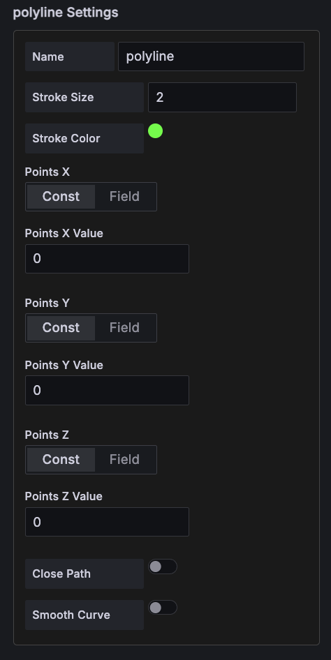
- Map coordinate arrays to `Points X/Y/Z` to draw trajectories or relative orbits.
- Enable `Close Path` for loops and `Smooth Curve` for spline interpolation.

### 9. Annotation objects
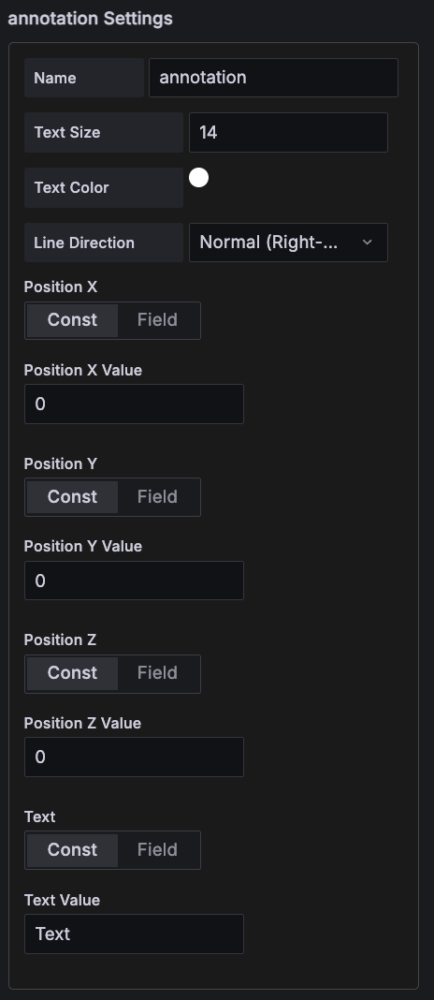
- Link text content and position to data fields for event callouts or labels.
- Adjust the connector direction, text color, and size for clarity.

### 10. Key parameters overlay

Overlays a fixed-format text list of data field values on top of the 3D view, under the **Key Parameters** category. The box's size depends only on the item count, names, and *Value Width* — never on the values themselves, so it never resizes as data changes.

- **Font Size**: Font size of the overlay text, in pixels.
- **Vertical Position** / **Horizontal Position**: Which edge and side the overlay is anchored to — `Top`/`Bottom` and `Left`/`Right`, combining into one of the four corners. Default: `Top` / `Left`.
- **Separator**: Text placed between each parameter's name and value — `:`, `=`, or a plain space.
- **Value Width**: Fixed width of the value column, in characters. Values shorter than this are right-padded with spaces; longer ones are truncated from the right, so the column width never changes.
- **Text Color**: Color of the overlay text.
- **Background**: Show a background behind the overlay text. Default: on, neutral gray at `0.25` opacity.
- **Background Color** / **Background Opacity**: Color and opacity (`0`-`1`) of the background, shown when *Background* is on.
- **Shape**: Corner style of the background/border — `Rectangle` or `Rounded`.
- **Border**: Show a border around the overlay. Default: on.
- **Border Color**: Color of the border, shown when *Border* is on.
- **Add Key Parameter**: Add a new value to the overlay. The list below shows every parameter; select one to edit it, use the eye icon to hide it, the arrows to reorder, and the trash icon to remove it.

Each key parameter has the following settings:

- **Name**: Display name, shown in the name column.
- **Data Field**: The field whose latest value is displayed, given either as `Series.Field` (for example `A.mode`) or as a bare field name (`mode`). Unlike the object position/quaternion fields, this accepts fields of any type (numeric, string, time, boolean, ...), not just numeric ones.
- **Format**: A single `printf`-style specifier plus any literal text, applied to the field's latest value — for example `%.2f`, `%.2f deg`, `%s`, `%d`, or `%+.1e`. Only the first specifier in the string is substituted with the value; anything else is shown as-is. When the field can't be resolved, `-` is shown instead of a value.

If the overlay is placed in the top-left corner while **Show Position and Distance** (Camera Settings) is on, or in the top-right corner while the **Save/Reset Camera** buttons are shown, it automatically shifts down to avoid overlapping them.

## Data assignment tips

- Each field can switch between `Const` (fixed value) and `Field` (data source column).
- When your data source holds multiple time-series, pre-computing tables that align X/Y/Z/Quat columns simplifies panel configuration.
- Use an object ID in `Target Object` to make the camera track that asset.

## License
Provided under the GNU Lesser General Public License v3.0.

Author: ISAS/JAXA, [NAKAHIRA, Satoshi](https://orcid.org/0000-0001-9307-046X) and OZAKI, Mei (© 2025).
