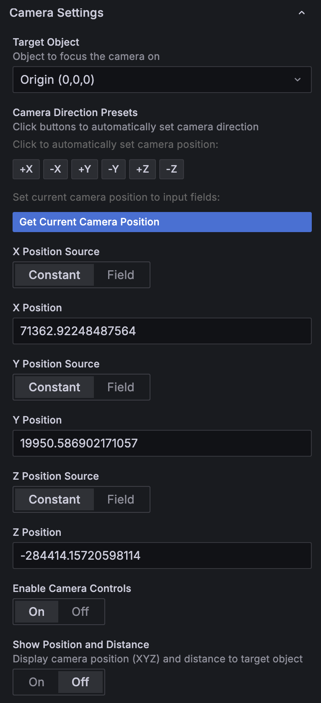

# Rendezvous 3D Panel

This Grafana panel plugin visualizes rendezvous telemetry for spacecraft in 3D. Operators can review position, attitude, and mission events in the same scene to build a shared situational awareness.

## Sample visualizations

### Relative layout of spacecraft and target asteroid

Register multiple objects (e.g., chaser spacecraft, target body, navigation markers) and review their relative positions and trajectories in one view via attitude-aware 3D models, spherical markers, and time-series polylines.

### Operations log view with annotations

Annotation objects synchronize timestamps and notes with your data source so that key events appear in context. Switch the callout direction to fine-tune readability.

### Overview of the full rendezvous

Switch camera targets to orbit around multiple assets. Scale adjustments let you inspect close-proximity docking maneuvers and long-range navigation within the same scene.

## Panel configuration guide

### 1. Lighting and background

- Use `Background Color` to mimic deep space or adapt the palette to your operations environment.
- Tune `Directional/Ambient/Environment Map` to achieve the desired look for metallic spacecraft and markers.

### 2. View-angle based auto scaling

- Configure `Target Angular Size` and `Min/Max Size` to automatically scale spheres or 3D models relative to camera distance.
- Only objects with Auto Radius or Auto Scale enabled participate, balancing long-range visibility with close-range legibility.

The algorithm is implemented in `ViewAngleScaling.calculateViewBasedScale` (`src/components/utils/ViewAngleScaling.ts`). Each render cycle invokes `ThreeSceneObjectManager.updateViewAngleScaling`, which runs the workflow below.

1. Compute the Euclidean distance `d` between the camera and the object.
2. Use `targetAngularSize` (radians) to derive a physical size with constant apparent angle via `S = 2 * d * tan(targetAngularSize / 2)`.
3. Acquire the object's maximum bounding-length `L` (diameter for spheres, measured at model import for 3D models) and compute `scaleRaw = S / L`.
4. Clamp `scaleRaw` with `minSize` and `maxSize`, apply the aspect ratio adjustment `applyShapeAdjustment`, and multiply by `userData.originalScale` (including Auto Scale Factor and unit conversions) to produce the final scale.

Because this calculation runs immediately after camera movement, objects retain a consistent angular size through zoom operations. Disabling Auto Radius/Auto Scale sets `viewAngleConfig.enabled` to `false`, keeping the original scale.

### 3. Camera control and focus

- Drive camera position with telemetry fields or constants.
- Enable `Enable Controls` to allow free-flight camera control via mouse input in Grafana.
- Specify a `Target Object` to keep the camera locked onto a chosen asset.

### 4. Object management

- Add any number of objects, adjusting draw order and visibility on demand.
- Choose a shape type (Sphere / 3D Model / Polyline / Annotation) under `Add Object`.

### 5. Object list and ordering

- Drag the right-side handle to reorder objects and control their render priority.
- Toggle `Visible` to hide or show an object temporarily.

### 6. Sphere objects

- Assign telemetry to `Pos X/Y/Z` fields to visualize targets as spheres.
- Enable `Auto Radius` for view-angle scaling and fine-tune with `Auto Scale Factor`.

### 7. 3D model objects

- Provide a GLTF or similar URL to load spacecraft geometry; a reference cube renders by default when no model is supplied.
- Bind telemetry to position and quaternion (`Quat X/Y/Z/W`) fields to show attitude.
- Choose `Unit` (`km` or `m`) to normalize the scale.

### 8. Polyline objects

- Map coordinate arrays to `Points X/Y/Z` to draw trajectories or relative orbits.
- Enable `Close Path` for loops and `Smooth Curve` for spline interpolation.

### 9. Annotation objects

- Link text content and position to data fields for event callouts or labels.
- Adjust the connector direction, text color, and size for clarity.

## Data assignment tips

- Each field can switch between `Const` (fixed value) and `Field` (data source column).
- When your data source holds multiple time-series, pre-computing tables that align X/Y/Z/Quat columns simplifies panel configuration.
- Use an object ID in `Target Object` to make the camera track that asset.

## License
Provided under the GNU Lesser General Public License v3.0.

Author: ISAS/JAXA, [NAKAHIRA, Satoshi](https://orcid.org/0000-0001-9307-046X) and OZAKI, Mei (© 2025).
