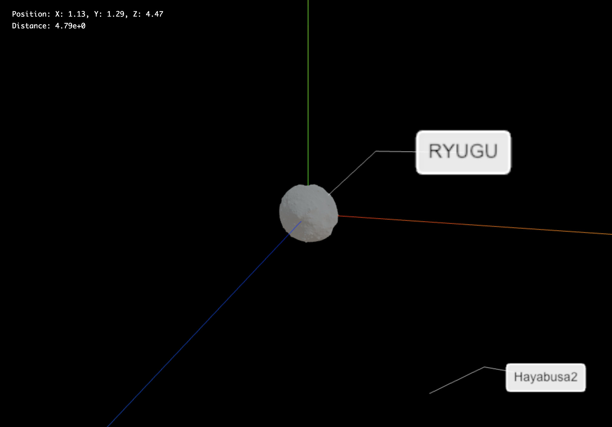
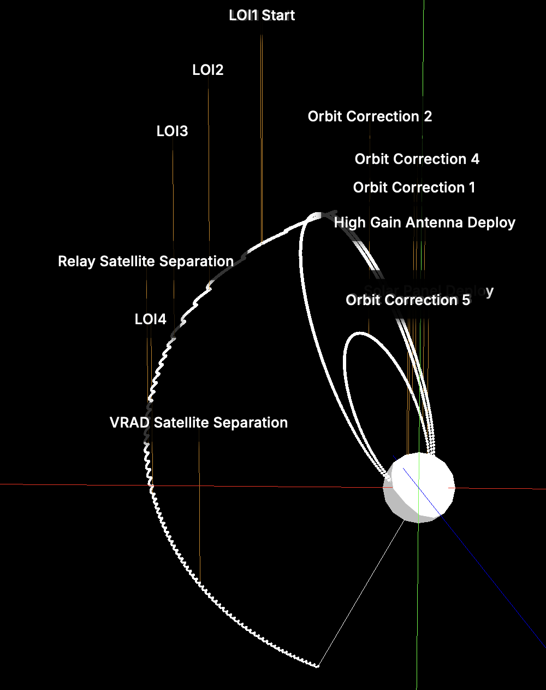
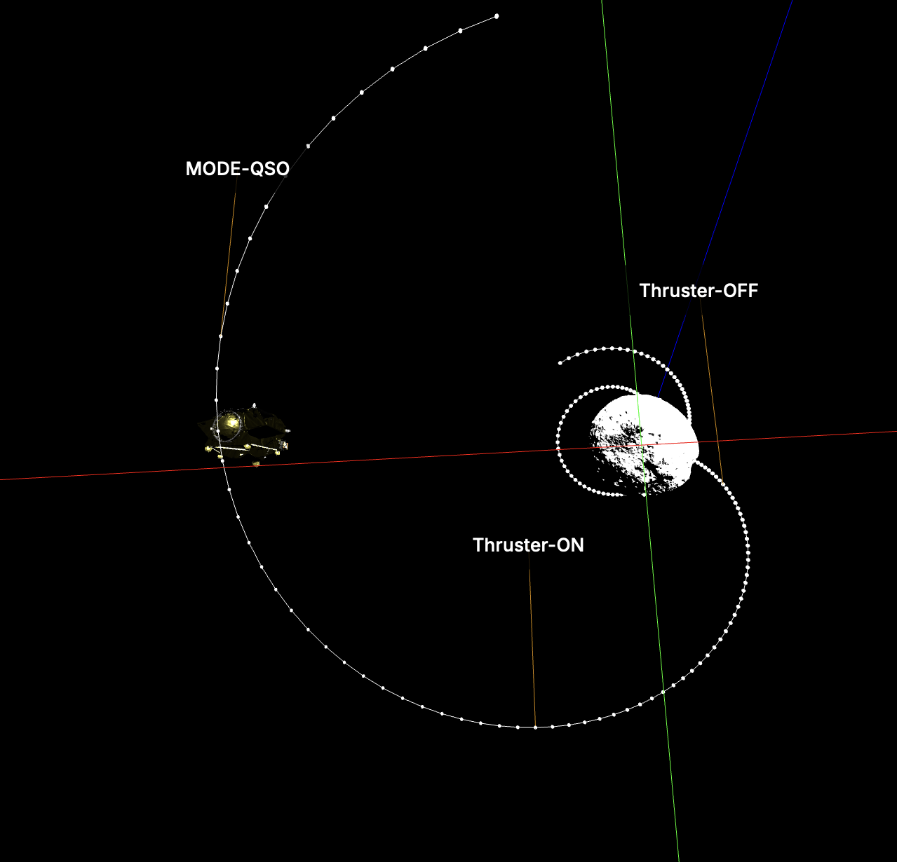
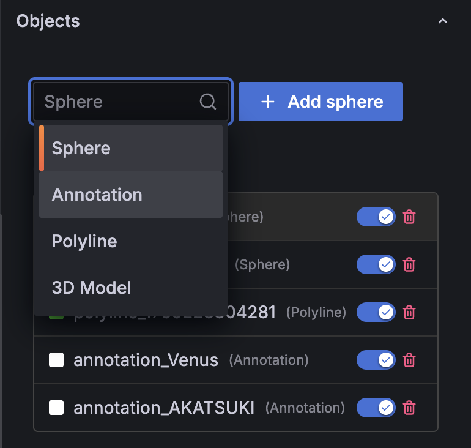
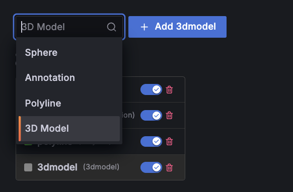
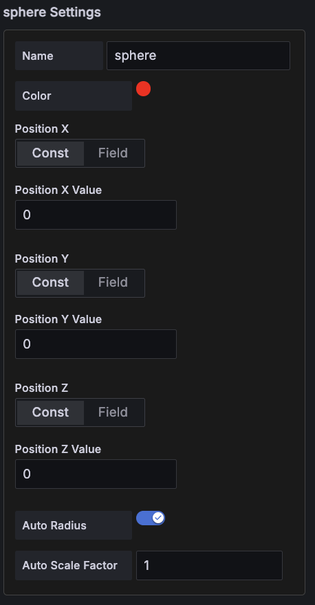

# Rendezvous 3D Panel

宇宙機のランデブー運用に用いられるテレメトリを3D空間で俯瞰できるGrafanaパネルプラグインです。位置・姿勢・イベントを同じシーンで確認でき、運用オペレーションの共有理解を高めます。

## 表示例

### 探査機とターゲット小惑星の相対配置

複数のオブジェクト（例: 探査機、ターゲット天体、誘導用マーカー）を登録し、姿勢付き3Dモデルと球体マーカー、時系列ポリラインで相対位置と軌跡を一画面で確認できます。

### イベント注釈を重ねた運用ログビュー

アノテーションオブジェクトを使うと、特定イベントの時刻・メモをデータソースと連動させて表示できます。ライン方向を切り替えて視認性を調整可能です。

### ランデブー全体の俯瞰

カメラのターゲットを切り替えながら、複数の物体を俯瞰表示。スケール調整によりローカルなドッキング操作から広域の航行状況まで同じシーンで確認できます。

## パネル設定ガイド

### 1. ライティングと背景

- `Background Color` で宇宙空間を模した背景色や運用環境に合わせた色味を指定
- `Directional/Ambient/Environment Map` を調整して金属質な機体やマーカーの見え方を整えます

### 2. 視野角ベースの自動スケーリング

- `Target Angular Size` と `Min/Max Size` を設定すると、距離に応じて球体（Sphere）や3Dモデルのサイズを自動調整
- Auto Radius / Auto Scale を有効にしたオブジェクトのみが対象となり、遠距離での視認性と近接時の判別しやすさを両立します

アルゴリズムは `ViewAngleScaling.calculateViewBasedScale`（`src/components/utils/ViewAngleScaling.ts`）で実装されています。シーン描画ごとに `ThreeSceneObjectManager.updateViewAngleScaling` が呼び出され、以下の処理を行います。

1. カメラ座標とオブジェクト座標のユークリッド距離 `d` を計算します。
2. 設定値 `targetAngularSize`（ラジアン）を用い、視野角が一定になる物理サイズ `S = 2 * d * tan(targetAngularSize / 2)` を導出します。
3. オブジェクトのバウンディングボックス最大長 `L`（Sphereでは直径、3D Modelではモデル読み込み時に計測）を取得し、必要スケール `scaleRaw = S / L` を算出します。
4. `minSize` と `maxSize` で `scaleRaw` をクランプし、アスペクト比補正 `applyShapeAdjustment` を掛けた後、`userData.originalScale`（Auto Scale Factor や unit 変換を含む）と乗算して最終スケールを得ます。

この計算はカメラが移動した直後にも適用されるため、ズーム操作に追従して常に同じ画角でオブジェクトが表示されます。Auto Radius/Auto Scale を無効にすると `viewAngleConfig.enabled` が `false` になり、元のスケールが維持されます。

### 3. カメラ制御と注視対象

- テレメトリフィールドや定数を用いてカメラ位置を制御
- `Enable Controls` を有効にするとGrafana上でマウスドラッグによる自由視点操作が可能
- `Target Object` を設定すると指定オブジェクトを中心にカメラが追従します

### 4. オブジェクト管理

- 任意の数のオブジェクトを追加し、表示順や可視状態をパネル内で切り替えます
- `Add Object` から形状タイプ（Sphere / 3D Model / Polyline / Annotation）を選択

### 5. オブジェクト一覧と並び替え

- 右側のハンドラで並び順を変更し、手前に描画する要素を調整
- `Visible` スイッチで一時的な表示切り替えが可能

### 6. Sphere（球体）オブジェクト

- 位置（Pos X/Y/Z）にテレメトリを割り当て、可視化対象を球体で表現
- `Auto Radius` 有効時は視野角ベースで自動スケールし、`Auto Scale Factor` で微調整

### 7. 3D Model オブジェクト

- GLTF等のURLを指定すると宇宙機モデルを読み込み、未指定時は基準となるキューブを自動描画
- 位置とクォータニオン（Quat X/Y/Z/W）をテレメトリに紐づけて姿勢表示
- `Unit` を `km` / `m` から選択してスケール補正

### 8. Polyline（軌跡・ベクトル）オブジェクト

- Points X/Y/Z に座標配列を割り当て、航跡や相対軌道を描画
- `Close Path` でループ、`Smooth Curve` でスプライン補間を適用

### 9. Annotation（注釈）オブジェクト

- テキスト内容と位置をデータに紐づけ、イベント説明やラベルを表示
- ライン方向や文字色・サイズを調整して視認性を確保

## データ割り当てのポイント

- 各フィールドは `Const`（固定値）と `Field`（データソース列）を切り替えて使用できます
- データソースに複数の時系列がある場合は、Data Warehouse 側で X/Y/Z/Quat を揃えたテーブルを用意しておくと設定が容易です
- オブジェクトIDを `Target Object` に指定するとカメラの注視中心として利用できます

## ライセンス
GNU Lesser General Public License v3.0 の下で提供されています。

著作者: ISAS/JAXA and [NAKAHIRA, Satoshi](https://orcid.org/0000-0001-9307-046X) (© 2025)。
